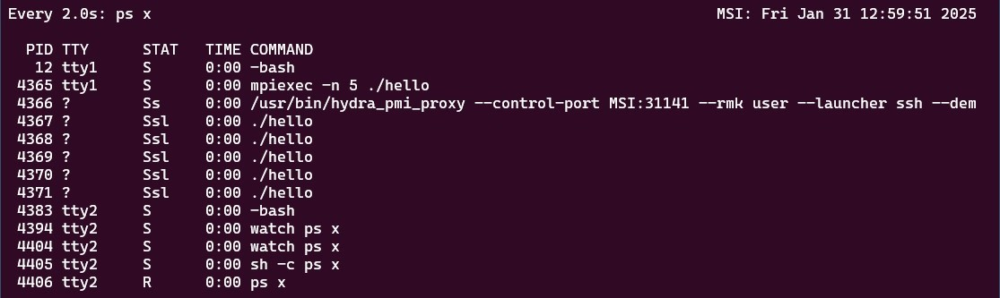
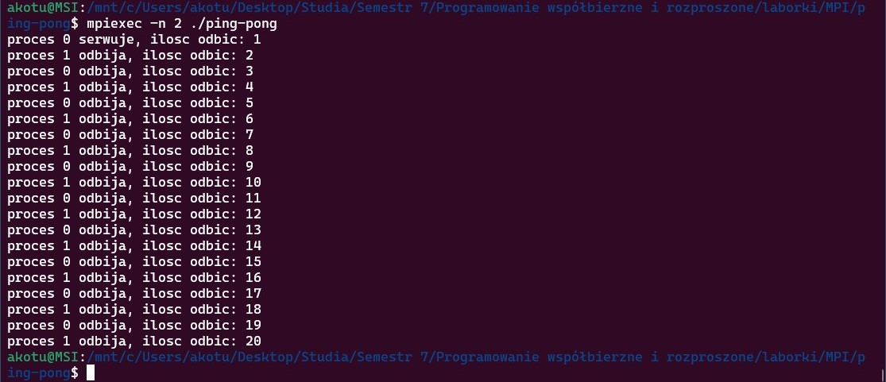
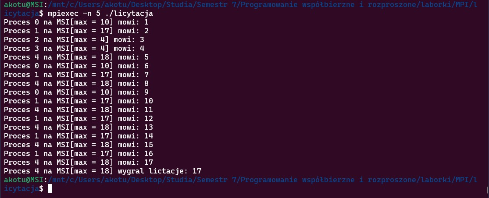

### [Laboratorium 5](https://artemis.wszib.edu.pl/~funika/pwir/MPI/lab1/)
# Temat: Message Passing Interface (MPI)
### **Andrzej Kotulski**
#### 8.12.2024r.

---


## 1. Co było do zrobienia

W ramach laboratorium z Message Passing Interface (MPI) należało wykonać następujące zadania:

1. Za pomocą komendy `ps x` (lub `watch ps x`) zaobserwować działające procesy MPI, modyfikując działanie programu `hello.c`, aby wykonywał się dłużej.
2. Napisać program ping-pong, w którym dwa procesy komunikują się za pomocą `MPI_Send` i `MPI_Recv`, zwiększając wartość zmiennej `val` do 20.
3. Rozbudować program `licytacja.c`, aby obsługiwał dowolną liczbę procesów i realizował proces licytacji.

## 2. Podejście do rozwiązania problemu

- W ćwiczeniu 1 program został zmodyfikowany poprzez dodanie pętli `for` i opóźnienia `sleep(1)`, aby procesy były widoczne w systemie przez dłuższy czas.
- W ćwiczeniu 2 napisano program wykorzystujący `MPI_Send` i `MPI_Recv` do komunikacji między dwoma procesami, które naprzemiennie przesyłały wartość zmiennej `val`, zwiększając ją o 1 do osiągnięcia wartości 20.
- W ćwiczeniu 3 rozbudowano mechanizm licytacji, implementując przesyłanie wartości stawki w pętli, aż jeden z procesów zakończy licytację jako zwycięzca.

## 3. Fragmenty kodu

### Ćwiczenie 1 - Modyfikacja `hello.c`
```c
#include "mpi.h"  /* wlacza plik naglowkowy potrzebny dla biblioteki MPI */
#include <stdio.h> /* potrzebny dla funkcji 'fprintf()' */
#include <unistd.h> /* potrzebny dla funkcji 'sleep()' */

int main(int argc, char **argv) {
	int myid, namelen;
	char computer_name[512]; /* nazwa komputera na ktorym wykonuje sie proces */

	MPI_Init(&argc, &argv);  /* inicjalizuje srodowisko MPI */

	/* pobiera identyfikator biezacego procesu */
	MPI_Comm_rank(MPI_COMM_WORLD, &myid);

	/* Pobiera nazwe komputera na ktorym proces sie wykonuje */
 	MPI_Get_processor_name(computer_name, &namelen);

	for (int i = 0; i < 100; i++) {
		printf("Hello from process %d on %s\n", myid, computer_name);
		sleep(1);
	}
	/* konczy dzialanie srodowiska MPI */
	MPI_Finalize();

  return 0;
}
```

### Ćwiczenie 2 - Program `ping-pong.c`
```c
#include "mpi.h"  /* wlacza plik naglowkowy potrzebny dla biblioteki MPI */
#include <stdio.h> /* potrzebny dla funkcji 'fprintf()' */
#include <unistd.h> /* potrzebny dla funkcji 'sleep()' */

int main(int argc, char **argv) {
	const int LIMIT = 20;
	int id, size;

	/* inicjalizuje srodowisko MPI */
	MPI_Init(&argc, &argv);

	/* pobiera identyfikator biezacego procesu */
	MPI_Comm_rank(MPI_COMM_WORLD, &id);

	/* pobieranie liczby procesów*/
	MPI_Comm_size(MPI_COMM_WORLD, &size);

	/* zapewnienie ilosci procesow = 2*/
	if(size != 2) {
		printf("Program nalezy uruchomic z dwoma procesami \n");
		MPI_Abort(MPI_COMM_WORLD, 1);
	}

	int count = 0;
	int partner_id = (id +1 ) % 2;

	/* proces 0 serwuje*/
	if(id == 0) {
		count++;
		printf("proces %d serwuje, ilosc odbic: %d \n", id, count);
		MPI_Send(&count, 1, MPI_INT, partner_id, 0, MPI_COMM_WORLD);
	}

	while(count < LIMIT) {
		MPI_Recv(&count, 1, MPI_INT, partner_id, 0, MPI_COMM_WORLD, MPI_STATUS_IGNORE);
		sleep(1);
		if(count < LIMIT){
			count++;
			printf("proces %d odbija, ilosc odbic: %d \n", id, count);
			MPI_Send(&count, 1, MPI_INT, partner_id, 0, MPI_COMM_WORLD);
		}
	}

	/* konczy dzialanie srodowiska MPI */
	MPI_Finalize();
}
```

### Ćwiczenie 3 - Program `licytacja.c`
```c
#include "mpi.h"  /* wlacza plik naglowkowy potrzebny dla biblioteki MPI */
#include <stdio.h> /* potrzebny dla funkcji 'fprintf()' */
#include <stdlib.h>
#include <time.h> /* potrzebny dla funcji 'time()' */
#include <unistd.h> /* potrzebny dla funkcji 'sleep()' */

int main(int argc, char **argv) {
	int myid, namelen, i, size;
	char computer_name[512]; /* nazwa komputera na ktorym */
	int a[2];

	MPI_Status status;

	MPI_Init(&argc, &argv);  /* inicjalizuje srodowisko MPI */

	/* pobiera identyfikator biezacego procesu */
	MPI_Comm_rank(MPI_COMM_WORLD, &myid);

	/* Pobiera nazwe komputera na ktorym proces sie wykonuje */
	MPI_Get_processor_name(computer_name, &namelen);

	/* pobieranie liczby procesów*/
	MPI_Comm_size(MPI_COMM_WORLD, &size);

	srandom(time(NULL) + myid * 20);
	int maxBid = random() % 20 + 1;
	int currentBid = 0;
	int nextId = (myid == size - 1) ? 0 : myid + 1;
	int prevId = (myid == 0) ? size - 1 : myid - 1;

	/* proces 0 zaczyna licytacje*/
	if (myid == 0) {
		a[0] = 1;
		a[1] = myid;
		MPI_Send(a, 2, MPI_INT, nextId, 12, MPI_COMM_WORLD);
		fprintf(stderr, "Proces %d na %s[max = %d] mowi: %d\n", myid, computer_name, maxBid, a[0]);
	}

	while(1) {
		MPI_Recv(a, 2, MPI_INT, prevId, 12, MPI_COMM_WORLD, MPI_STATUS_IGNORE);

		if(a[0] == currentBid) {
			if(a[1] == myid) {
				fprintf(stderr, "Proces %d na %s[max = %d] wygral lictacje: %d\n", myid, computer_name, maxBid, a[0]);
			}
			MPI_Send(a, 2, MPI_INT, nextId, 12, MPI_COMM_WORLD);
			break;
		} else {
			if(a[0] < maxBid) {
				a[0] += 1;
				a[1] = myid;
				fprintf(stderr, "Proces %d na %s[max = %d] mowi: %d\n", myid, computer_name, maxBid, a[0]);
				usleep(100000);
			}
		}
		currentBid = a[0];
		MPI_Send(a, 2, MPI_INT, nextId, 12, MPI_COMM_WORLD);
	}

	/* konczy dzialanie srodowiska MPI */
	MPI_Finalize();

	return 0;
}
```

## 4. Wyniki

- W ćwiczeniu 1 udało się zaobserwować procesy MPI w systemie za pomocą `watch ps x`:
  
  

- W ćwiczeniu 2 procesy poprawnie komunikowały się i osiągały wartość `val = 20`.

  

- W ćwiczeniu 3 procesy licytowały w pętli, a jeden z nich kończył licytację jako zwycięzca.

  

## 5. Wnioski

- MPI umożliwia prostą komunikację między procesami przy użyciu `MPI_Send` i `MPI_Recv`.
- Procesy MPI mogą działać na wielu maszynach lub na jednej, komunikując się przez `MPI_COMM_WORLD`.
- Implementacja komunikacji wymaga precyzyjnej synchronizacji i kontroli przepływu danych.

## 6. Bibliografia

- Dokumentacja MPI: <https://www.mpi-forum.org/docs/>
- Kurs MPI dr. St. Polaka
- Materiały z laboratorium
- MPICH: Wydajna i szeroko przenośna implementacja Interfejsu Przesyłania Wiadomości (MPI): <https://www.mpich.org/> 

## 7. Załączniki

1. **Repozytorium kodu źródłowego** – Pełny kod projektu. Dostępne online: <https://github.com/akotu235/MPI>

2. **Wersja online sprawozdania** – Bieżąca wersja dokumentu. Dostępne online: <https://github.com/akotu235/MPI/blob/master/report/report1.md>