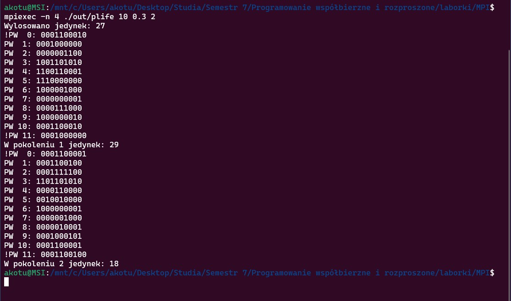

### [Laboratorium 6](https://artemis.wszib.edu.pl/~funika/pwir/MPI/lab2/)
# Temat: Komunikacja kolektywna w MPI
### **Andrzej Kotulski**
#### 22.12.2024r.

---


## 1. Co było do zrobienia
Celem projektu było zrównoleglenie sekwencyjnej implementacji Gry w Życie przy użyciu standardu MPI. Algorytm symuluje ewolucję komórek na dwuwymiarowej planszy zgodnie z określonymi zasadami:

- Komórka umiera z **samotności**, jeśli ma 1 lub mniej sąsiadów.
- Komórka umiera z **przeludnienia**, jeśli ma 4 lub więcej sąsiadów.
- Komórka przeżywa, jeśli ma 2 lub 3 sąsiadów.
- Nowa komórka powstaje, jeśli dokładnie 3 sąsiedzi są żywi.

## 2. Podejście do rozwiązania problemu
### Kroki implementacyjne:
1. **Inicjalizacja MPI**:
    - Dodano `MPI_Init`, `MPI_Comm_rank`, `MPI_Comm_size` oraz `MPI_Finalize`.
    - Dołączono nagłówek `mpi.h`.

2. **Podział danych**:
    - Każdy proces alokuje tablicę o rozmiarze `(N/psize + 2) x N` (+2 dla wierszy brzegowych).
    - Proces `0` generuje całą planszę i rozsyła fragmenty do pozostałych procesów za pomocą `MPI_Send`/`MPI_Recv`.

3. **Wymiana zakładek**:
    - Sąsiednie procesy wymieniają się wierszami brzegowymi przy użyciu **`MPI_Sendrecv`**

4. **Warunki brzegowe**:
    - **Poziomo**: Zaimplementowano periodyczność za pomocą operacji modulo na kolumnach.
    - **Pionowo**: Zakładki są wymieniane między procesami, a wiersze `0` i `N+1` są kopiowane z ostatniego/pierwszego wiersza planszy.

5. **Zbieranie wyników**:
    - Proces `0` zbiera dane od wszystkich procesów i wypisuje całą planszę.
    - Liczba żywych komórek jest agregowana przez **`MPI_Reduce`**.

## 3. Fragmenty kodu

###  Program `plife.c`
```c
#include <stdio.h>
#include <stdlib.h>
#include <mpi.h>
#include <time.h>

int main(int argc, char **argv) {
    int K, N;
    int **tab, **tab2, **tmpwsk;
    int i, j, jed = 0, nb_count;
    int pokolenie, il_pok;
    double pp; // prawdopodobieństwo jedynki
    int myid, psize;
    int local_rows, reszta;

    MPI_Init(&argc, &argv);
    MPI_Comm_rank(MPI_COMM_WORLD, &myid);
    MPI_Comm_size(MPI_COMM_WORLD, &psize);

    //odczytanie parametrow wywolania programu
    if (myid == 0) {
        if (argc != 4) {
            fprintf(stderr, "Błąd! Złe wywołanie. \n Użycie: %s <rozmiar> <prawdopodobieństwo> <pokoleń>\n", argv[0]);
            MPI_Abort(MPI_COMM_WORLD, 1);
        }
        N = K = atoi(argv[1]);
        pp = atof(argv[2]);
        il_pok = atoi(argv[3]);
        if (pp > 1 || pp < 0) {
            fprintf(stderr, "Błąd! Prawdopodobieństwo poza zakresem!!\n");
            MPI_Abort(MPI_COMM_WORLD, 1);
        }
    }

    MPI_Bcast(&N, 1, MPI_INT, 0, MPI_COMM_WORLD);
    MPI_Bcast(&pp, 1, MPI_DOUBLE, 0, MPI_COMM_WORLD);
    MPI_Bcast(&il_pok, 1, MPI_INT, 0, MPI_COMM_WORLD);

    //alokacja pamieci na tablice
    reszta = N % psize;
    local_rows = N / psize;
    if (myid < reszta) local_rows++;

    tab = (int **)calloc(local_rows + 2, sizeof(int *));
    tab2 = (int **)calloc(local_rows + 2, sizeof(int *));
    for (i = 0; i < local_rows + 2; i++) {
        tab[i] = (int *)calloc(N, sizeof(int));
        tab2[i] = (int *)calloc(N, sizeof(int));
    }

    //wypelnianie pola poczatkowymi wartosciami (tylko proces 0)
    if (myid == 0) {
        int **global_tab = (int **)malloc(N * sizeof(int *));
        for (i = 0; i < N; i++)
            global_tab[i] = (int *)malloc(N * sizeof(int));

        srandom(time(NULL));
        for (i = 0; i < N; i++)
            for (j = 0; j < N; j++)
                global_tab[i][j] = (random() % 100 < pp * 100) ? 1 : 0;

        // Rozsyłanie danych do procesów
        int current_row = 0;
        for (int r = 0; r < psize; r++) {
            int rows_r = (r < reszta) ? (N/psize + 1) : (N/psize);
            if (r == 0) {
                for (i = 0; i < rows_r; i++)
                    for (j = 0; j < N; j++)
                        tab[i+1][j] = global_tab[current_row + i][j];
            } else {
                for (i = 0; i < rows_r; i++)
                    MPI_Send(global_tab[current_row + i], N, MPI_INT, r, 0, MPI_COMM_WORLD);
            }
            current_row += rows_r;
        }

        for (i = 0; i < N; i++) free(global_tab[i]);
        free(global_tab);
    } else {
        for (i = 1; i <= local_rows; i++)
            MPI_Recv(tab[i], N, MPI_INT, 0, 0, MPI_COMM_WORLD, MPI_STATUS_IGNORE);
    }

    // Obliczanie początkowych jedynek
    int initial_jed = 0;
    for (i = 1; i <= local_rows; i++)
        for (j = 0; j < N; j++)
            initial_jed += tab[i][j];

    int global_jed;
    MPI_Reduce(&initial_jed, &global_jed, 1, MPI_INT, MPI_SUM, 0, MPI_COMM_WORLD);
    if (myid == 0) fprintf(stderr, "Wylosowano jedynek: %d\n", global_jed);

    // Główna pętla pokoleń
    for (pokolenie = 1; pokolenie <= il_pok; pokolenie++) {
        jed = 0;

//==============================

        // Przesyłanie zakładek
        if (psize > 1) {
            int next_rank = (myid + 1) % psize;
            int prev_rank = (myid - 1 + psize) % psize;

            // Wyślij dół do next_rank, odbierz górę od prev_rank
            MPI_Sendrecv(
                &tab[local_rows][0], N, MPI_INT, next_rank, 0,
                &tab[0][0], N, MPI_INT, prev_rank, 0,
                MPI_COMM_WORLD, MPI_STATUS_IGNORE
            );

            // Wyślij górę do prev_rank, odbierz dół od next_rank
            MPI_Sendrecv(
                &tab[1][0], N, MPI_INT, prev_rank, 1,
                &tab[local_rows + 1][0], N, MPI_INT, next_rank, 1,
                MPI_COMM_WORLD, MPI_STATUS_IGNORE
            );
        } else {
            // Obsługa periodyczności dla jednego procesu
            for (j = 0; j < N; j++) {
                tab[0][j] = tab[local_rows][j];
                tab[local_rows + 1][j] = tab[1][j];
            }
        }

//==============

        // Wypisywanie macierzy po komunikacji
        if (myid == 0) {
            int **global_tab = (int **)malloc((N + 2) * sizeof(int *));
            for (i = 0; i < N + 2; i++) {
                global_tab[i] = (int *)malloc(N * sizeof(int));
            }

            // Proces 0 kopiuje swoje dane do global_tab
            for (i = 1; i <= local_rows; i++) {
                for (j = 0; j < N; j++) {
                    global_tab[i][j] = tab[i][j];
                }
            }

            // Proces 0 odbiera dane od innych procesów
            int current_row = local_rows;
            for (int r = 1; r < psize; r++) {
                int rows_r = (r < reszta) ? (N / psize + 1) : (N / psize);
                for (i = 0; i < rows_r; i++) {
                    MPI_Recv(global_tab[current_row + i + 1], N, MPI_INT, r, 0, MPI_COMM_WORLD, MPI_STATUS_IGNORE);
                }
                current_row += rows_r;
            }

            for (j = 0; j < N; j++) {
                global_tab[0][j] = global_tab[N][j];     // Wiersz 0 = ostatni wiersz
                global_tab[N + 1][j] = global_tab[1][j]; // Wiersz N+1 = pierwszy wiersz
            }

            // Wypisanie całej macierzy
            for (i = 0; i <= N + 1; i++) {
                if (i == 0 || i == N + 1) printf("!");
                printf("PW%3d: ", i);
                for (j = 0; j < N; j++) {
                    printf("%d", global_tab[i][j]);
                }
                printf("\n");
            }

            // Zwolnienie pamięci
            for (i = 0; i < N + 2; i++) {
                free(global_tab[i]);
            }
            free(global_tab);
        } else {
            // Inne procesy wysyłają swoje dane do procesu 0
            for (i = 1; i <= local_rows; i++) {
                MPI_Send(tab[i], N, MPI_INT, 0, 0, MPI_COMM_WORLD);
            }
        }

        // Obliczanie nowego pokolenia
        tmpwsk = tab2; tab2 = tab; tab = tmpwsk;

        for (i = 1; i <= local_rows; i++) {
            for (j = 0; j < N; j++) {
                // Liczenie sąsiadów
                nb_count =
                    tab2[i-1][(j-1+N)%N] + tab2[i-1][j] + tab2[i-1][(j+1)%N] +
                    tab2[i][(j-1+N)%N]   +                  tab2[i][(j+1)%N] +
                    tab2[i+1][(j-1+N)%N] + tab2[i+1][j] + tab2[i+1][(j+1)%N];

                // Aktualizacja komórki
                if (nb_count == 3) {
                    tab[i][j] = 1;
                } else if (nb_count == 2) {
                    tab[i][j] = tab2[i][j];
                } else {
                    tab[i][j] = 0;
                }
                jed += tab[i][j];
            }
        }

        // Zbieranie i wyświetlanie wyników
        MPI_Reduce(&jed, &global_jed, 1, MPI_INT, MPI_SUM, 0, MPI_COMM_WORLD);
        if (myid == 0)
            printf("W pokoleniu %d jedynek: %d\n", pokolenie, global_jed);
    }

    // Zwolnienie pamięci
    for (i = 0; i < local_rows + 2; i++) {
        free(tab[i]);
        free(tab2[i]);
    }
    free(tab);
    free(tab2);

    MPI_Finalize();
    return 0;
}
```

## 4. Wyniki

### Przykładowe uruchomienie:
```bash
mpicc plife.c -o plife
mpirun -np 4 ./plife 10 0.3 2
```

### Rezultat:

  

## 5. Wnioski

Zrównoleglenie znacząco przyspiesza symulację dla dużych plansz, jednak w przypadku małych rozmiarów narzut komunikacyjny MPI może przewyższyć zyski z równoległego przetwarzania.

## 6. Bibliografia

1. Dokumentacja MPI: <https://www.mpi-forum.org/docs/>

2. Kurs MPI dr. St. Polaka

3. Materiały z laboratorium

4. MPICH: Wydajna i szeroko przenośna implementacja Interfejsu Przesyłania Wiadomości (MPI): <https://www.mpich.org/> 

## 7. Załączniki

1. **Repozytorium kodu źródłowego** – Pełny kod projektu. Dostępne online: <https://github.com/akotu235/MPI>

2. **Wersja online sprawozdania** – Bieżąca wersja dokumentu. Dostępne online: <https://github.com/akotu235/MPI/blob/master/report/report2.md>