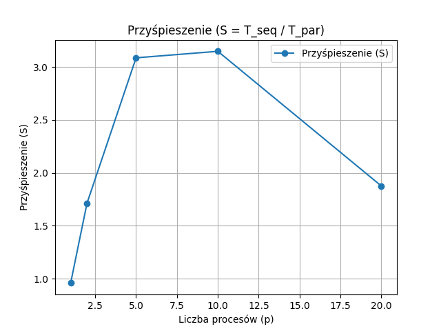
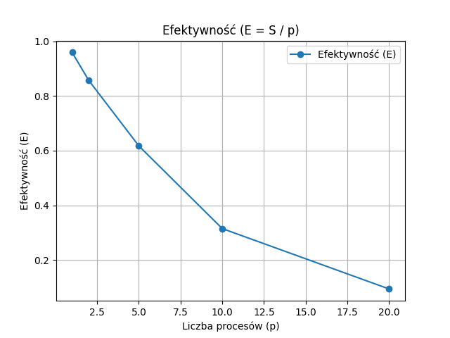

### [Laboratorium 7](https://artemis.wszib.edu.pl/~funika/pwir/MPI/lab4/)
# Temat: Obliczenie liczby $\pi$ z wykorzystaniem MPI
### **Andrzej Kotulski**
#### 19.01.2025r.

---


## 1. Co było do zrobienia

Celem laboratorium było:

1. Zaimplementowanie sekwencyjnego programu obliczającego wartość $\pi$ metodą Monte Carlo.
2. Stworzenie równoległej wersji programu z wykorzystaniem MPI zgodnie z metodologią PCAM.
3. Przeprowadzenie pomiarów czasu wykonania dla liczby procesów: $1, 2, 5, 10, 20$.
4. Obliczenie przyśpieszenia ($S$) i efektywności ($E$) oraz wygenerowanie wykresów.

## 2. Podejście do rozwiązania problemu

### Metoda Monte Carlo
- Losowanie punktów w kwadracie o boku $2r$ i zliczanie tych, które trafiły w koło o promieniu $r$.
- Liczba losowanych punktów: im większa, tym dokładniejsze oszacowanie wartości $\pi$.
- Wzór: $\pi \approx 4 \times \frac{\text{liczba trafień}}{\text{liczba próbek}}$

### Równoległość z MPI
- **Podział danych**: Każdy proces oblicza część próbek.
- **Komunikacja**: Procesy WORKER wysyłają wyniki do MASTER, który agreguje dane.
- **Synchronizacja**: Pomiar czasu obejmował inicjalizację MPI, obliczenia i komunikację.

## 3. Fragmenty kodu

### Program sekwencyjny - `pi_sequential.c`:

```c
#include <stdio.h>
#include <stdlib.h>
#include <time.h>
#include <sys/time.h>

double random_coordinate(double radius) {
    return (2.0 * rand() / RAND_MAX - 1.0) * radius;
}

int main() {
    const int total_samples = 1000000000;
    const double radius = 16.0;
    int hits = 0;

    struct timeval start, end;
    gettimeofday(&start, NULL);

    srand(time(NULL));

    for (int i = 0; i < total_samples; i++) {
        double x = random_coordinate(radius);
        double y = random_coordinate(radius);
        if (x*x + y*y <= radius*radius) {
            hits++;
        }
    }

    double pi = 4.0 * (double)hits / total_samples;

    gettimeofday(&end, NULL);
    double time_spent = (end.tv_sec - start.tv_sec) + (end.tv_usec - start.tv_usec) / 1e6;

    printf("Approximated Pi: %f\n", pi);
    printf("Time: %f seconds\n", time_spent);

    return 0;
}
```

### Program równoległy - `pi_parallel.c`:

```c
#include <stdio.h>
#include <stdlib.h>
#include <time.h>
#include <sys/time.h>
#include <mpi.h>

double random_coordinate(double radius) {
    return (2.0 * rand() / RAND_MAX - 1.0) * radius;
}

int main(int argc, char** argv) {
    struct timeval start, end;
    gettimeofday(&start, NULL);

    MPI_Init(&argc, &argv);

    int rank, size;
    MPI_Comm_rank(MPI_COMM_WORLD, &rank);
    MPI_Comm_size(MPI_COMM_WORLD, &size);

    const int total_samples = 1000000000;
    const double radius = 16.0;

    // Podział próbek
    int remainder = total_samples % size;
    int num_per_proc = total_samples / size;
    if (rank < remainder) {
        num_per_proc++;
    }

    int local_hits = 0;

    srand(time(NULL) + rank * 12345);

    for (int i = 0; i < num_per_proc; i++) {
        double x = random_coordinate(radius);
        double y = random_coordinate(radius);
        if (x*x + y*y <= radius*radius) {
            local_hits++;
        }
    }

    // Zbieranie wyników
    if (rank == 0) {
        int total_hits = local_hits;
        int temp_hits;
        for (int src = 1; src < size; src++) {
            MPI_Recv(&temp_hits, 1, MPI_INT, src, 0, MPI_COMM_WORLD, MPI_STATUS_IGNORE);
            total_hits += temp_hits;
        }
        double pi = 4.0 * (double)total_hits / total_samples;
        printf("Approximated Pi: %f\n", pi);
    } else {
        MPI_Send(&local_hits, 1, MPI_INT, 0, 0, MPI_COMM_WORLD);
    }

    MPI_Finalize();

    // Zakończenie pomiaru czasu
    if (rank == 0) {
        gettimeofday(&end, NULL);
        double time_spent = (end.tv_sec - start.tv_sec) + (end.tv_usec - start.tv_usec) / 1e6;
        printf("Total execution time with %d processes: %f seconds\n", size, time_spent);
    }

    return 0;
}
```

## 4. Wyniki

*Podczas eksperymentów liczba wylosowanych punktów wynosiła 1 000 000 000.*

### Przykład uruchomienia programu `pi_sequential.c`:

**Kompilacja**:

```sh
gcc pi_sequential.c -o pi_sequential
```

**Uruchomienie**:

```sh
.pi_sequential
```

**Rezultat**:

```
Approximated Pi: 3.141641
Time: 39.795256 seconds
```

### Przykład uruchomienia programu `pi_parallel.c`:

**Kompilacja**:

```sh
mpicc pi_parallel.c -o pi_parallel
```

**Uruchomienie**:

```sh
mpiexec -n 5 pi_parallel

```

**Rezultat**:

```
Approximated Pi: 3.141545
Total execution time with 5 processes: 16.505941 seconds
```

### Wyniki pomiarów czasu, przyśpieszenia i efektywności dla różnej liczby procesów:

| Procesy ($p$) | Czas $T(p)$ [s] | Przyśpieszenie ($S$) | Efektywność ($E$) |  
|---------------|-----------------|----------------------|-------------------|
| 1             | 41.485278       | 0.959262             | 0.959262          |
| 2             | 23.229635       | 1.713124             | 0.856562          |
| 5             | 12.896586       | 3.085720             | 0.617144          |
| 10            | 12.644495       | 3.147240             | 0.314724          |
| 20            | 21.220689       | 1.875305             | 0.093765          |

### Wykres przyśpieszenia programu równoległego:

  

### Wykres efektywności programu równoległego:

  

## 5. Wnioski

1. **Przyśpieszenie**: Rośnie wraz z liczbą procesów, ale dla $p > 10$ spowalnia z powodu narzutu komunikacyjnego.
2. **Efektywność**: Maleje logarytmicznie – dodanie kolejnych procesów nie kompensuje kosztów komunikacji.

## 6. Bibliografia

1. Dokumentacja MPI: <https://www.mpi-forum.org/docs/>

2. [Materiały z laboratorium](https://artemis.wszib.edu.pl/~funika/pwir/MPI/lab4/)

3. MPICH: Wydajna i szeroko przenośna implementacja Interfejsu Przesyłania Wiadomości (MPI): <https://www.mpich.org/> 

4. Dokumentacja biblioteki Matplotlib: <https://matplotlib.org/stable/contents.html>

## 7. Załączniki

1. **Repozytorium kodu źródłowego** – Pełny kod projektu. Dostępne online: <https://github.com/akotu235/MPI>

2. **Wersja online sprawozdania** – Bieżąca wersja dokumentu. Dostępne online: <https://github.com/akotu235/MPI/blob/master/report/report3.md>